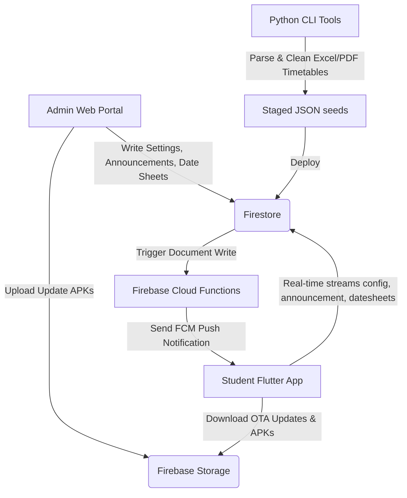

# IRIS Enhanced: System Architecture & Reference Guide

This document provides a comprehensive explanation of the architecture, modules, frontend, backend, and data flows of the **IRIS Enhanced** project.

---

## 🗺️ System Architecture Overview

IRIS Enhanced is a hybrid student organizer system that leverages real-time synchronization. It consists of a mobile client app, an administrative web portal, automated python tools, and a serverless backend powered by Google Cloud & Firebase.

---

## 📱 1. Mobile Frontend (Flutter App)

The mobile client app is built in Flutter, providing a premium, fluid, and hardware-accelerated user experience.

* **Core Entry Point**: [lib/main.dart](file:///d:/Ai%20models/IRIS/lib/main.dart) orchestrates app boot, registers background persistent class tracking services (`FlutterForegroundTask`), and initializes the widget tree.
* **Sync Architecture**: The remote connection engine is located in [lib/services/remote_config_service.dart](file:///d:/Ai%20models/IRIS/lib/services/remote_config_service.dart). It opens a Firestore listener stream directly on `config/global` to:
  * Detect academic phase shifts (e.g., class weeks vs. exam weeks).
  * Automatically download and merge Over-The-Air (OTA) daily class timetables.
  * Listen for active midterm/final date sheets.
  * Trigger local notifications for changes in room schedules or instructor assignments.
* **User Interface**: Designed with custom visual effects (glassmorphism/3D tilt/liquid glass engine) situated in `lib/widgets/` and `lib/core/`.

---

## 💻 2. Administrative Frontend (Web Portal)

The admin web portal is a single-page management console deployed to Firebase Hosting.

* **Structure**: Built with semantic HTML in [admin_portal/index.html](file:///d:/Ai%20models/IRIS/admin_portal/index.html) and custom styling in [admin_portal/styles.css](file:///d:/Ai%20models/IRIS/admin_portal/styles.css).
* **Control Controller**: [admin_portal/app.js](file:///d:/Ai%20models/IRIS/admin_portal/app.js) interacts with Firebase Auth, Firestore, and Storage.
* **Capabilities**:
  * Authenticates admins securely.
  * Performs live database resets and wipes for timetables/exams.
  * Parses uploaded date sheet files (Excel) directly in the browser and pushes clean structured arrays to Firestore.
  * Broadcasts live notification cards to student devices in real-time.
  * Deploys OTA application APK packages to Firebase Storage and updates the global update configuration metadata card.

---

## ☁️ 3. Backend & Cloud Infrastructure (Firebase)

The backend is completely serverless, utilizing Firebase for database, hosting, storage, functions, and security.

### 🗄️ Firestore Database
Stores the application's configuration, active timetables, and administrative records.
* **`config/global` Document**: The principal heartbeat configuration document containing:
  * `academic_period`: Current academic phase mode (`classes`, `midterms`, `finals`, `sports_week`).
  * `active_timetable_json`: The parsed master daily class schedule JSON.
  * `active_midterm_json` / `active_finals_json`: JSON arrays containing exams schedule listings.
  * `latest_apk_update`: Map metadata of the latest compiled Android app update.
  * `broadcast_message`: Text content for active alerts.
* **`admins` Collection**: Documents matched by User UID containing administrator attributes.

### 📦 Firebase Storage
Stores dynamic binaries and media:
* Hosts the latest compiled Android application package (`.apk`) files for OTA updates.

### ⚡ Cloud Functions
* **Path**: [functions/index.js](file:///d:/Ai%20models/IRIS/functions/index.js)
* **Function (`sendAnnouncementPush`)**: Listens to create events on the `/announcements` collection. When a new announcement is written, it automatically fetches all registered client push tokens from `/user_tokens` and broadcasts an FCM push notification instantly to students.

---

## 🛠️ 4. Local Processing & Parser Tools

Located in the `tools/` folder, these Python scripts assist admins with heavy local operations:

* **Excel/PDF Parsing**: Parses complex multi-row class schedules and exam datesheets into compliant JSON tables before database uploads.
* **Backup/Migration Scripts**: Helper utilities in `tools/migration/` track history snapshots of the database configurations and perform legacy schema transfers.
