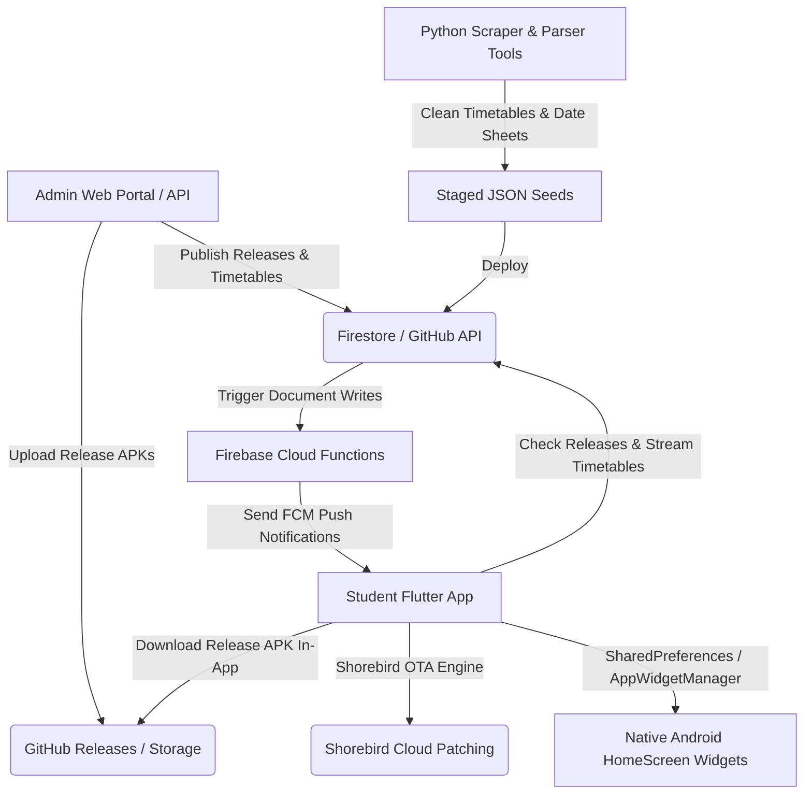

# 🌌 IRIS Enhanced: Comprehensive System Architecture & Reference Guide

This document provides a complete explanation of the system architecture, frontend, backend, native Android widgets, Office Open XML engine, Shorebird OTA code push, and data flows of **IRIS Enhanced**.

---

## 🗺️ System Architecture Overview

IRIS Enhanced is a hybrid student organizer system leveraging real-time synchronization, native Android OS AppWidget providers, Office Open XML document generation, and dual-engine over-the-air updates.

---

## 📱 1. Mobile Client Application (Flutter Engine)

The mobile client app is built using Flutter & Dart with custom liquid glass visual engines and native platform channels.

* **Main Bootstrapping**: [`lib/main.dart`](file:///d:/Iris%20Working%20backup/MOST%20RECENT/IRIS/lib/main.dart) initializes app state, background persistent class tracking services (`FlutterForegroundTask`), home widget sync handlers, and theme management.
* **Document Workspace Engine**: [`lib/screens/document_workspace_screen.dart`](file:///d:/Iris%20Working%20backup/MOST%20RECENT/IRIS/lib/screens/document_workspace_screen.dart) incorporates raw hardware pointer listeners (`Listener.onPointerMove`) for unrestricted 360° image dragging and resizing on canvas without touch arena conflicts.
* **Native Word Open XML Generator**: [`lib/services/docx_generator.dart`](file:///d:/Iris%20Working%20backup/MOST%20RECENT/IRIS/lib/services/docx_generator.dart) builds 100% specification-compliant `.docx` ZIP packages containing native XML runs for headers (`#`, `##`), bullet lists (`- `, `* `), and markdown inline formatting (`**bold**`, `*italic*`, `` `code` ``).
* **In-App GitHub Auto-Updater**: [`lib/services/update_service.dart`](file:///d:/Iris%20Working%20backup/MOST%20RECENT/IRIS/lib/services/update_service.dart) fetches latest release metadata from GitHub REST API, streams real-time download progress (`0% ➔ 100%`), and triggers 1-tap package installation via `open_filex`.

---

## 📱 2. Native Android HomeScreen AppWidget Providers

The native Android layer houses high-performance native AppWidget providers with frosted glass drawables and DP-based height responsiveness.

* **Live Class Widget Provider**: [`android/app/src/main/kotlin/com/example/student_organizer/ClassTrackerWidget.kt`](file:///d:/Iris%20Working%20backup/MOST%20RECENT/IRIS/android/app/src/main/kotlin/com/example/student_organizer/ClassTrackerWidget.kt)
  * Implements density-independent DP breakpoints (`heightDp < 105dp` ➔ Compact Bar; `105dp <= heightDp < 145dp` ➔ Standard Card; `heightDp >= 145dp` ➔ Hero Card).
  * Includes fail-safe fallback `RemoteViews` inflation to guarantee zero "error loading widget" failures.
* **Portal Tasks Widget Provider**: [`android/app/src/main/kotlin/com/example/student_organizer/PortalTasksWidget.kt`](file:///d:/Iris%20Working%20backup/MOST%20RECENT/IRIS/android/app/src/main/kotlin/com/example/student_organizer/PortalTasksWidget.kt) and adapter service [`PortalTasksWidgetService.kt`](file:///d:/Iris%20Working%20backup/MOST%20RECENT/IRIS/android/app/src/main/kotlin/com/example/student_organizer/PortalTasksWidgetService.kt) bind assignment & quiz lists into native RemoteViews ListViews.

---

## ⚡ 3. Dual-Engine Update System

IRIS utilizes a hybrid update mechanism:

1. **Shorebird Over-The-Air (OTA) Code Push**:
   * Pushes Flutter Dart UI features, bug fixes, and layout tweaks **silently in ~10 seconds**.
   * Requires zero user interaction—patches load automatically on app restart.
2. **In-App GitHub Package Installer**:
   * Used when native Kotlin (`.kt`) code, Android permissions, or native plugins change.
   * Downloads `app-release.apk` with live progress modal and triggers 1-tap in-place update without data loss.

---

## 💻 4. Administrative Frontend & Cloud Infrastructure

* **Admin Web Portal**: [`admin_portal/index.html`](file:///d:/Iris%20Working%20backup/MOST%20RECENT/IRIS/admin_portal/index.html) and [`admin_portal/app.js`](file:///d:/Iris%20Working%20backup/MOST%20RECENT/IRIS/admin_portal/app.js) provide admin authentication, live timetable resets, date sheet uploads, and push notification triggers.
* **Firestore Configuration**: Document `config/global` holds academic phase status (`classes`, `midterms`, `finals`, `sports_week`), active timetables, and notification broadcasts.
* **Cloud Functions**: [`functions/index.js`](file:///d:/Iris%20Working%20backup/MOST%20RECENT/IRIS/functions/index.js) listens to creation events on `/announcements` and sends FCM push notifications to student devices.
