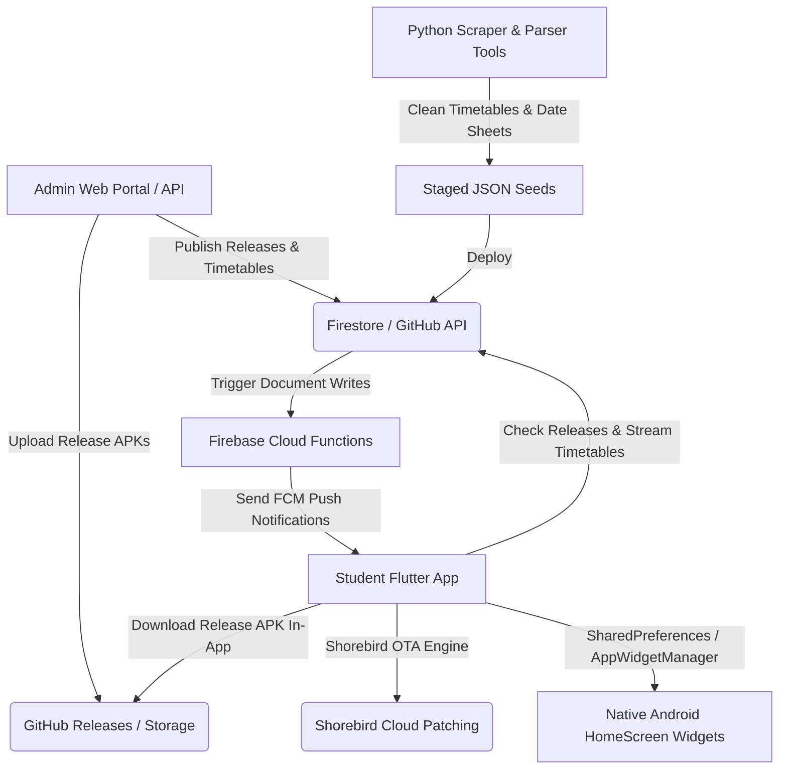

# 🌌 IRIS Enhanced: Comprehensive System Architecture & Reference Guide

This document provides a complete explanation of the system architecture, frontend, backend, native Android widgets, Office Open XML engine, Shorebird OTA code push, and data flows of **IRIS Enhanced**.

---

## 🗺️ System Architecture Overview

IRIS Enhanced is a hybrid student organizer system leveraging real-time synchronization, native Android OS AppWidget providers, Office Open XML document generation, and dual-engine over-the-air updates.



---

## 📱 1. Mobile Client Application (Flutter Engine)

The mobile client app is built using Flutter & Dart with custom liquid glass visual engines and native platform channels.

* **Main Bootstrapping**: [`lib/main.dart`](file:///d:/Iris%20Working%20backup/MOST%20RECENT/IRIS/lib/main.dart) initializes app state, background persistent class tracking services (`FlutterForegroundTask`), home widget sync handlers, and theme management.
* **Document Workspace Engine**: [`lib/screens/document_workspace_screen.dart`](file:///d:/Iris%20Working%20backup/MOST%20RECENT/IRIS/lib/screens/document_workspace_screen.dart) incorporates raw hardware pointer listeners (`Listener.onPointerMove`) for unrestricted 360° image dragging and resizing on canvas without touch arena conflicts.
* **Native Word Open XML Generator**: [`lib/services/docx_generator.dart`](file:///d:/Iris%20Working%20backup/MOST%20RECENT/IRIS/lib/services/docx_generator.dart) builds 100% specification-compliant `.docx` ZIP packages containing native XML runs for headers (`#`, `##`), bullet lists (`- `, `* `), and markdown inline formatting (`**bold**`, `*italic*`, `` `code` ``).
* **In-App GitHub Auto-Updater**: [`lib/services/update_service.dart`](file:///d:/Iris%20Working%20backup/MOST%20RECENT/IRIS/lib/services/update_service.dart) fetches latest release metadata from GitHub REST API, streams real-time download progress (`0% ➔ 100%`), and triggers 1-tap package installation via `open_filex`.

---

## 📱 2. Native Android HomeScreen AppWidget Providers

The native Android layer houses high-performance native AppWidget providers with frosted glass drawables and DP-based height responsiveness.

* **Live Class Widget Provider**: [`android/app/src/main/kotlin/com/iris/app/ClassTrackerWidget.kt`](file:///d:/Iris%20Working%20backup/MOST%20RECENT/IRIS/android/app/src/main/kotlin/com/iris/app/ClassTrackerWidget.kt)
  * Implements density-independent DP breakpoints (`heightDp < 105dp` ➔ Compact Bar; `105dp <= heightDp < 145dp` ➔ Standard Card; `heightDp >= 145dp` ➔ Hero Card).
  * Includes fail-safe fallback `RemoteViews` inflation to guarantee zero "error loading widget" failures.
* **Portal Tasks Widget Provider**: [`android/app/src/main/kotlin/com/iris/app/PortalTasksWidget.kt`](file:///d:/Iris%20Working%20backup/MOST%20RECENT/IRIS/android/app/src/main/kotlin/com/iris/app/PortalTasksWidget.kt) and adapter service [`PortalTasksWidgetService.kt`](file:///d:/Iris%20Working%20backup/MOST%20RECENT/IRIS/android/app/src/main/kotlin/com/iris/app/PortalTasksWidgetService.kt) bind assignment & quiz lists into native RemoteViews ListViews.

---

## ⚡ 3. Dual-Engine Update System

IRIS utilizes a hybrid update mechanism:

1. **Shorebird Over-The-Air (OTA) Code Push**:
   * Pushes Flutter Dart UI features, bug fixes, and layout tweaks **silently in ~10 seconds**.
   * Requires zero user interaction—patches load automatically on app restart.
2. **In-App GitHub Package Installer**:
   * Used when native Kotlin (`.kt`) code, Android permissions, or native plugins change.
   * Downloads `app-release.apk` with live progress modal and triggers 1-tap in-place update without data loss.

---

## 💻 4. Administrative Frontend & Cloud Infrastructure

* **Admin Web Portal**: [`admin_portal/index.html`](file:///d:/Iris%20Working%20backup/MOST%20RECENT/IRIS/admin_portal/index.html) and [`admin_portal/app.js`](file:///d:/Iris%20Working%20backup/MOST%20RECENT/IRIS/admin_portal/app.js) provide admin authentication (Firebase Project `iris-138ef`), live timetable deployments, exam date sheet parsing, semester milestones management, and push notification triggers.
* **Firestore Configuration**: Document `config/global` holds academic phase status (`classes`, `midterms`, `finals`, `sports_week`), active timetables, live semester schedules (`semester_schedule`), and notification broadcasts.
* **Cloud Functions**: [`functions/index.js`](file:///d:/Iris%20Working%20backup/MOST%20RECENT/IRIS/functions/index.js) listens to creation events on `/announcements` and sends FCM push notifications to student devices.

---

## 🔄 5. End-to-End Verified Data Pipelines

```
                   ┌─────────────────────────────────────────┐
                   │          OFFICIAL UNIVERSITY            │
                   │   Portal & Public Helpdesk System       │
                   └────────────────────┬────────────────────┘
                                        │
                   ┌────────────────────┴────────────────────┐
                   │                                         │
        (Scraped via Headless WebView)            (WhatsApp PDFs & Excels)
                   │                                         │
                   ▼                                         ▼
    ┌─────────────────────────────┐           ┌─────────────────────────────┐
    │     IRIS HEADLESS SYNC      │           │    FIREBASE ADMIN PORTAL    │
    │  Session Cookies + JS Engine│           │ Firestore Database Storage  │
    └──────────────┬──────────────┘           └──────────────┬──────────────┘
                   │                                         │
                   └────────────────────┬────────────────────┘
                                        │
                                        ▼
                   ┌─────────────────────────────────────────┐
                   │             IRIS FLUTTER APP            │
                   │  • Bento Grid Academic Insights         │
                   │  • 3D Rigged Animated Mascot Companion   │
                   │  • Liquid Glass Onboarding Setup        │
                   │  • Scraper-Backed Helpdesk & Transport  │
                   └─────────────────────────────────────────┘
```

### Pipeline A: Student Personal Portal Scraping Engine (`HeadlessPortalSync`)
* **Core Files**: [`lib/services/portal_scraper.js`](file:///d:/Iris%20Working%20backup/MOST%20RECENT/IRIS/lib/services/portal_scraper.js), [`lib/services/headless_portal_sync.dart`](file:///d:/Iris%20Working%20backup/MOST%20RECENT/IRIS/lib/services/headless_portal_sync.dart), [`lib/services/portal_sync_service.dart`](file:///d:/Iris%20Working%20backup/MOST%20RECENT/IRIS/lib/services/portal_sync_service.dart).
* **Execution Flow**:
  1. Student logs in once via the integrated WebView portal interface.
  2. Session cookies and authentication tokens are safely stored in local app storage.
  3. `portal_scraper.js` runs `scrapeAllCourses()`, fetching `/Assignments/Index` and `/Quizzes/Index` in parallel and parsing HTML tables.
  4. Extracted metrics are committed into `SharedPreferences` and local `UniversityMemory`.

### Pipeline B: WhatsApp Timetables & Firebase Admin OTA
* **Core Files**: [`admin_portal/app.js`](file:///d:/Iris%20Working%20backup/MOST%20RECENT/IRIS/admin_portal/app.js), [`lib/services/timetable_ota_service.dart`](file:///d:/Iris%20Working%20backup/MOST%20RECENT/IRIS/lib/services/timetable_ota_service.dart), [`lib/services/pdf_timetable_parser.dart`](file:///d:/Iris%20Working%20backup/MOST%20RECENT/IRIS/lib/services/pdf_timetable_parser.dart).
* **Execution Flow**:
  1. Official PDFs/Excels arrive via WhatsApp and are uploaded into the Firebase Admin Portal.
  2. The admin portal parses records, writes to Firestore `config/global`, and increments `active_timetable_version`.
  3. The mobile client's `TimetableOTAService` queries `config/global` on startup and seamlessly pulls the new `timetable_seed.json` without requiring an app rebuild.

### Pipeline C: Scraped Helpdesk, Transport & Semester Schedule
* **Core Files**: [`lib/services/helpdesk_schedule_data_service.dart`](file:///d:/Iris%20Working%20backup/MOST%20RECENT/IRIS/lib/services/helpdesk_schedule_data_service.dart), [`assets/helpdesk_backup/helpdesk_schedule_seed.json`](file:///d:/Iris%20Working%20backup/MOST%20RECENT/IRIS/assets/helpdesk_backup/helpdesk_schedule_seed.json).
* **Execution Flow**:
  1. Primary offline seed contains official milestones (`COMMENCEMENT OF CLASSES`, `MID EXAMS`, `TERMINAL EXAMS`, `RESULT ANNOUNCEMENT`), transport routes, and library schedules.
  2. `HelpdeskScheduleDataService` checks for live Firestore `semester_schedule` updates published by the admin and dynamically merges them over the local seed.
  3. Displays 1:1 consistent data on both the **Semester Schedule Subscreen** and the **Intelligent Insight Screen**.

---

## 🎨 6. UI Engine & Character Rigging

* **3D Rigged Animated Mascot (`IrisAnimatedMascot`)**: [`lib/widgets/iris_animated_mascot.dart`](file:///d:/Iris%20Working%20backup/MOST%20RECENT/IRIS/lib/widgets/iris_animated_mascot.dart) renders a 60 FPS vector character with waving moving hands (`waveAngle`), volumetric torso with glowing `✨` emblem, floating feet boots, top specular highlight reflection, antenna gem, glossy cartoon eyes with pupil sparkles, and Matrix4 3D perspective depth lens (`setEntry(3, 2, 0.0018)`).
* **Intelligent Insight Dashboard (`IntelligentInsightScreen`)**: [`lib/screens/intelligent_insight_screen.dart`](file:///d:/Iris%20Working%20backup/MOST%20RECENT/IRIS/lib/screens/intelligent_insight_screen.dart) renders an obsidian bento-grid with lowest attendance warning card (`⚠️ CSC322 Operating Systems • 68%`), pinned bus route picker, and category-filtered semester timeline.
* **Liquid Glass Onboarding (`OnboardingWizard`)**: [`lib/screens/setup_screens.dart`](file:///d:/Iris%20Working%20backup/MOST%20RECENT/IRIS/lib/screens/setup_screens.dart) features Student Name entry at top, `lgw.GlassMenu` dropdowns for Program/Semester/Section, Faculty directory confirmation sheet, and serene background particles (`0.12` drift velocity).

